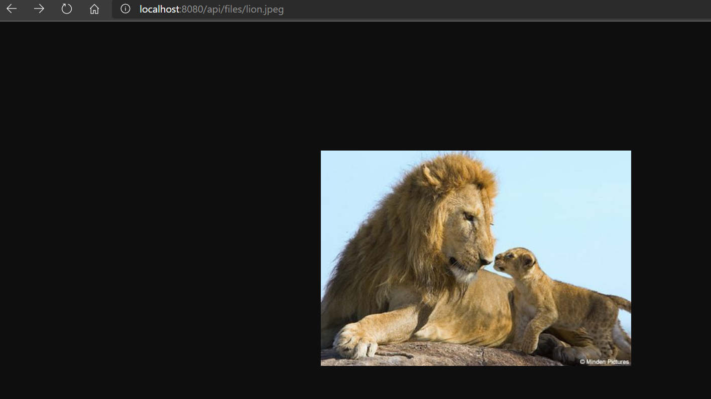

# 2.4 MongoDB Files API
Create Spring Boot API that allows uploading and serving files.


## Part 1: Implement a File uploader API

1. Clone this project and change the Database configuration with your own connection string in the following file:
        
**Done**

2. Run the project.

3. Go to your database and verify that the file was created under a fs.files and fs.chunks documents. 


  
5. Verify that the *getFileByName* endpoint works and it does returns the *lion.jpeg* file created on step 2 when requested by name.




6. Implement the *handleFileUpload* method. Make sure you return the static url to access the uploaded file by using the *getFileByName* endpoint.

    ````Java
       //Stores the file into MongoDB
        gridFsTemplate.store(file.getInputStream(), fileName, file.getContentType());
    ````

## Part 2: Integrate file uploader with React JS project

**Done**

## Part 3: Upgrade your Todo to accept files

**I couldn't do it, the previous version of the front uses Jwt to authenticate, 
this version of the back doesn't use that, additionally it completely changes the structure of the project
 and I didn't have time this week to implement everything again**

1. Inject the *TodoRepository* into the *RESTController* using *@Autowired* annotation.

2. Implement the *createTodo* and *getTodoList* methods of the *RESTController*.

3. Modify the *handleSubmit* method so it does call the API to create the *Todo* entry on the server and database:

    * Make asynchronous calls to upload file to the server
    * Once the file upload promise is fulfilled, then save the Todo entry using the *POST* method of the API.
    * Remember to save the *this* context into a variable to use it into the nested scopes!
   
4. Modify the *Todo* component on your React project so that it displays the Todo image:

    ````Javascript
          <td>{this.props.fileUrl ?  : <div/>}</td>
    ```` 

5. If you have not done it yet, implement and call the method to load the Todo list from the server:

    ```javascript
         loadDataFromServer() {
        
                let that = this;
        
                this.axios.get("todo").then(function (response) {
                    console.log("This is my todolist:  ", response.data);
                    that.setState({items: response.data})
                })
                    .catch(function (error) {
                        console.log(error);
                    });
            }

    ```    
    6. Implement the logic for the following scenario: if the file is not an image but a pdf file, then a file icon appears on the Todo component. When the file icon is clicked then the user gets redirected to the download page.
    
7. Verify that the project works as expected.
